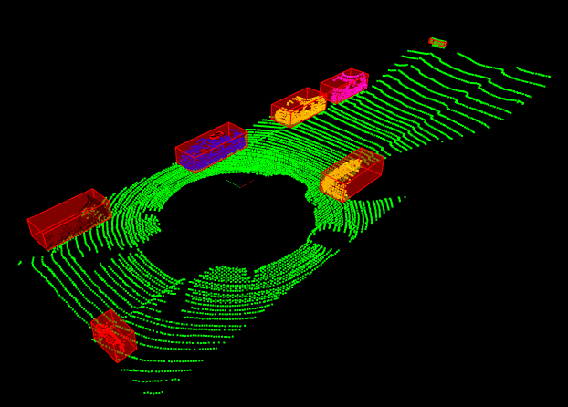

# Udacity Sensor Fusion Nanodegree, Project 1 Lidar Obstacle Detection

This is a fort from [Udacity's repository for the project](https://github.com/udacity/SFND_Lidar_Obstacle_Detection), where the code is compelted for presentation of a solution for the first project. For general information, please see [Udacity's repository](https://github.com/udacity/SFND_Lidar_Obstacle_Detection).




## Project assignment
The assignment was to replace the PCL's implementation for planar segmentation and Euclidean segmentation with own implementation based on the quizes done in the course work.

### Planar segmentation and clustering with Point Cloud Library
In the course, we learned to use PCL to perform the work. For planar segmentation, we used `pcl::SACSegmentation` to find the points in the largest plane that could be found.
```C++
// SegmentPlane: Finds a plane and uses SeparateCloud to present the results as two separate point clouds
template<typename PointT>
std::pair<typename pcl::PointCloud<PointT>::Ptr, typename pcl::PointCloud<PointT>::Ptr> ProcessPointClouds<PointT>::SegmentPlane(typename pcl::PointCloud<PointT>::Ptr cloud, int maxIterations, float distanceThreshold)
{

...

    pcl::SACSegmentation<PointT> seg;
    typename pcl::PointIndices::Ptr inliers {new pcl::PointIndices};
    typename pcl::ModelCoefficients::Ptr coefficients {new pcl::ModelCoefficients};

    seg.setOptimizeCoefficients(true);
    seg.setModelType(pcl::SACMODEL_PLANE);
    seg.setMethodType(pcl::SAC_RANSAC);
    seg.setMaxIterations(maxIterations);
    seg.setDistanceThreshold(distanceThreshold);

    seg.setInputCloud(cloud);
    seg.segment(*inliers, *coefficients);

...

}
```

For clusteing, first the data was moved to a pointer to a KdTree structure from PCL, `pcl::search::KdTree<PointT>::Ptr` and then `pcl::EuclideanClusterExtraction<PointT>` was used for segmentation.

```C++
// Clustering: Uses KdTree to segment the point cloud and returns the result as a vector of point clouds of the segments
template<typename PointT>
std::vector<typename pcl::PointCloud<PointT>::Ptr> ProcessPointClouds<PointT>::Clustering(typename pcl::PointCloud<PointT>::Ptr cloud, float clusterTolerance, int minSize, int maxSize)
{

...

    typename pcl::search::KdTree<PointT>::Ptr tree (new pcl::search::KdTree<PointT>);
    tree->setInputCloud (cloud);

    std::vector<pcl::PointIndices> cluster_indices;
    pcl::EuclideanClusterExtraction<PointT> ec;
    ec.setClusterTolerance (clusterTolerance);
    ec.setMinClusterSize (minSize);
    ec.setMaxClusterSize (maxSize);
    ec.setSearchMethod (tree);
    ec.setInputCloud (cloud);
    ec.extract (cluster_indices);

...

}
```

### Own implementation of planar segmentation and clustering
The code produced in the quizes was modified to be used in the `ProcessPointCloud` class. The modifications were mostly concerned

1. Changing the KdTree implementation from 2D to 3D
2. Adapt to the data structure of the code imposed by PCL

The modifications can be found in `src/projectImplementations.h` and the routinmember functions in `ProcessPointCloud` were modified to call the methods as shown below.

```C++
// SegmentPlane: Finds a plane and uses SeparateCloud to present the results as two separate point clouds
template<typename PointT>
std::pair<typename pcl::PointCloud<PointT>::Ptr, typename pcl::PointCloud<PointT>::Ptr> ProcessPointClouds<PointT>::SegmentPlane(typename pcl::PointCloud<PointT>::Ptr cloud, int maxIterations, float distanceThreshold)
{

...

    std::unordered_set<int> planarSegmentIndices = Ransac<PointT>(cloud, maxIterations, distanceThreshold);

...

}
```


```C++
// Clustering: Uses KdTree to segment the point cloud and returns the result as a vector of point clouds of the segments
template<typename PointT>
std::vector<typename pcl::PointCloud<PointT>::Ptr> ProcessPointClouds<PointT>::Clustering(typename pcl::PointCloud<PointT>::Ptr cloud, float clusterTolerance, int minSize, int maxSize)
{

...

    EuclideanClustering<PointT> ec(cloud);

    auto cluster_indices = ec.euclideanCluster(clusterTolerance, minSize, maxSize);

...

}
```

## Running the code

The project work was done on an Ubuntu 22.04 host, running an Ubuntu 20.04 containter. The code has been tested both on the mentioned container as well as Udacity's virtual environment.

### Ubuntu 20.04
If you are using Ubuntu 20.04, you should be able to execute the following command in a shell and see the results as shown in the above picture.

```sh
sudo apt install build-essential cmake git
sudo apt install libpcl-dev
git clone https://github.com/SaidZahrai/SFND_Lidar_Obstacle_Detection 
cd SFND_Lidar_Obstacle_Detection 
mkdir build && cd build
cmake ..
make
./environment
```

### Docker container
If you are not using Ubuntu 20.04, a simple way to move forward would be to use a docker container. With some searches on internet and lots of experimentation, I succeeded to have the container set up for my machine with the `Dockerfile` that you find in the repository.

You should first build the container with
```sh
git clone https://github.com/SaidZahrai/SFND_Lidar_Obstacle_Detection 
cd SFND_Lidar_Obstacle_Detection 
docker build -t sfnd_d .
```
and then start the docker container with the script `start_cmd` in the repository, which contains
```sh
xhost +local:root

docker run -ti --rm  \
       -u 1000:1000 \
       -e DISPLAY=$DISPLAY \
       -v /tmp/.X11-unix:/tmp/.X11-unix  \
       -v ~/git/SFND_Lidar_Obstacle_Detection:/home/developer/SFND \
       -w /home/developer/SFND \
       --device /dev/dri --group-add=$(stat -c "%g" /dev/dri/render*) \
       sfnd_d /bin/bash
       
xhost -local:root
```
Note that I clone the repository in `~/git/.` and then in the above command, I map that to `/home/developer/SFND/` which will also be the entry point. In that case, once you are on the container you can continue with the following commands
```
mkdir build && cd build
cmake ..
make
./environment
```

The major difficulty I met was to have the graphics workig. With the above setup, I map the drivers so that the virtual machine access the graphics hardware directly. Note that I had Intel graphics hardware. You need to adapt your steps, or use a different base image, in case you have Nvidia, ot anther hardware.
